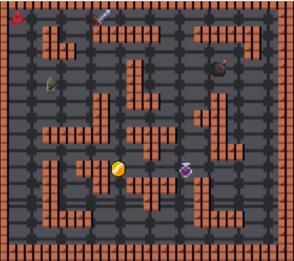

# Dungeonmania

## Change Log (2022)

- Mon 10 Oct 6pm: Add quote

- Tue 11 Oct 8am: Fix due date to have correct day

- Thu 13 Oct 9pm: Remove merc + zombie running away from MVP spec and tests in monolith

- Thu 13 Oct 9pm: Add advice about splitting open refactoring into seperate MRs

- Sat 15 Oct 8am: Rephrase Task 3

- Sun 16 Oct 6pm: Update Task 3 marking criteria

- Sun 16 Oct 9pm: Remove merc movement when player is invisible behaviour

- Wed 19 Oct 8am: Remove concept of assassin recon radius

- Thu 20 Oct 8am: Update ally movement specification

- Sun 23 Oct 5pm: Update logical entities technical spec

- Mon 24 Oct 11am: Add credits + switch wire image

- Wed 26 Oct 10am: Update logical entities example image

- Sat 29 Oct 3pm: Update logical entities specification

- Sun 30 Oct 10am: Update note about backwards compatibility in Part Three

- Mon 31 Oct 8am: Clarify logical entities wording

- Mon 31 Oct 9pm: Remove dependency on sun stone/midnight armour in Time Travel

- Wed 3 Nov 10pm: Remove dependency on mind control in Persistence

## The Game

In Dungeon Mania you control a Player and have to complete various goals within a series of dungeons to complete the game!

The simplest form of such a puzzle is a maze, where the Player must find their way from the starting point to the exit.

  

More advanced puzzles may contain things like boulders that need to be pushed onto floor switches, enemies that need to be fought with weapons, or collectables like potions and treasure.

## Credits
- If no specific license is specified it's public domain permissible (i.e. usable in commercial/non-commercial products) but no explicit license was found.

- Frontend + monolith built by cs2511: Braedon Wooding, Nick Patrikeos, George Litsas, Noa Challis, Chloe Cheong, Sienna Archer, Tina Ji, Webster Zhang, Adi Kishore

- The one ring: Created by Jordan Irwin (AntumDeluge)

- Mercenary: Animated Ranger by Calciumtrice, usable under Creative Commons Attribution 3.0 license.

- Portals: Portals made by RodHakGames - RHG

- Boulder: This work, made by Viktor Hahn (Viktor.Hahn@web.de), is licensed under the Creative Commons Attribution 4.0 International License. Creative Commons — Attribution 4.0 International — CC BY 4.0 

- Alagard Font: Made by Pix3M, usable under Creative Commons Attribution 3.0 license.

- Armor + Shield: Made by Zeno

- Tileset + Some Random Entities: Made by egordorichev, these assets are public domain and free to use on whatever you want, personal or commercial (aka CC0 license).

- Coin/Treasure: By La Red Games

- Zombie Toast: By LHTeam [@LazyHamsters](https://twitter.com/LazyHamsters)

- Toaster: By Reakain; LICENCE: This asset pack can be used in both free and commercial projects. You can modify it to suit your own needs. Credit is not necessary, but very appreciated. You may not redistribute it or resell it.

- Spider: By Elthen